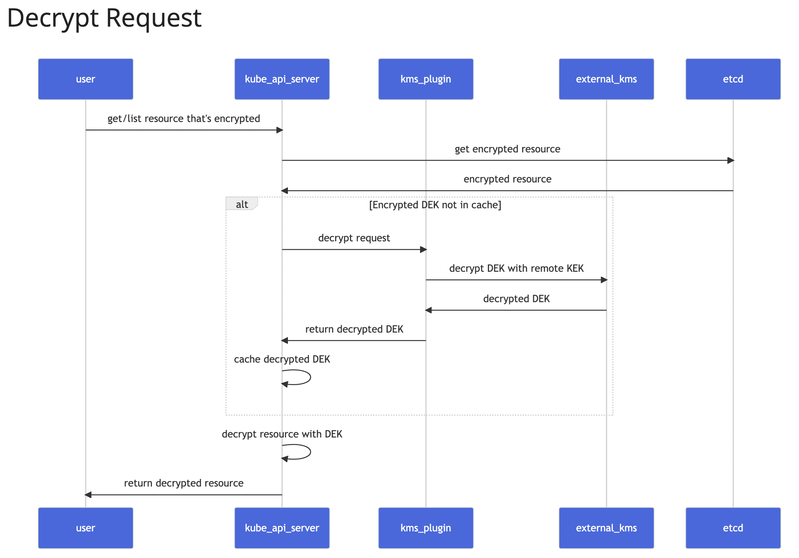
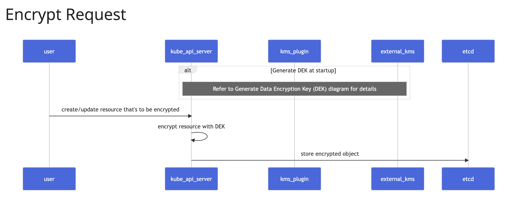
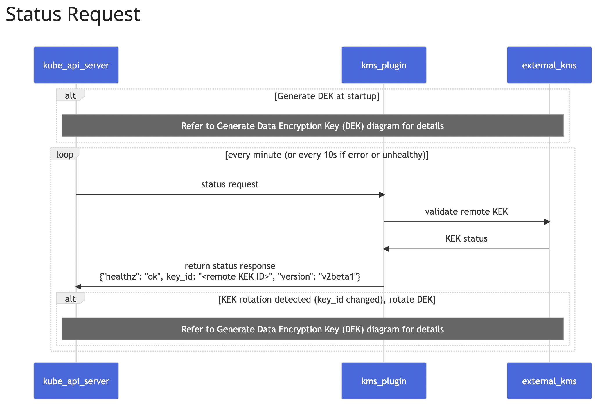
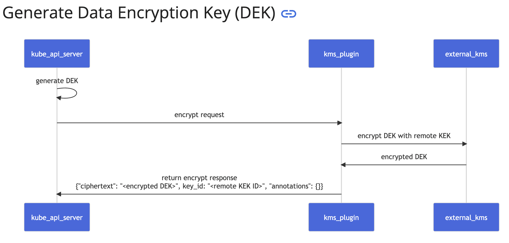

## Kubernetes KMS Plugin

### Acknowledgement
This project was created during my time at Infocomm Media Development Authority (IMDA). All rights goes to IMDA.

### Introduction
This project is an extension of the Kubernetes KMSv2 feature, which aims to enable encryption-at-rest using a KMS plugin. The main motivation is to integrate a physical random generator into the on-premise server create a HSM-like system for more secure encryption.

In my design, the KMS plugin will communicate with an on-premise server via REST APIs. The key encryption keys (KEKs) are generated by running a script on the on-premise server, and then saved in the on-premise server. Only the ciphertext/ plaintext is returned to the plugin via REST APIs.

Code for the on-premise-server can be found at https://github.com/kaijun123/kms-on-premise-server. The on-premise-server must be running before running the plugin.

### Branches and Docker Images
Docker Images:
- Container images for this repo is found on Dockerhub at https://hub.docker.com/repository/docker/kaijun123/kubernetes-kms/general

Branches:
- ```pseudo-rng```:
  - branch to run when testing the plugin
  - Does not involve the use of the QRNG; uses a RNG algo
  - Kubernetes cluster and kms-on-premise server runs on the same laptop/ machine
  - Plugin image to use: ***kaijun123/kubernetes-kms:v8***
- ```qrng```:
  - branch to run when qrng is in use
  - Does not involve the use of the QRNG; uses a RNG algo
  - Kubernetes cluster runs on MacOS, and kms-on-premise server runs a Linux OS
  - Plugin image to use: ***kaijun123/kubernetes-kms:v9***
- ```master```: master branch from the kubernetes/kms repo

**NOTE**: 
- While testing out the capabilities of the device, some technical challenges/restrictions were faced.
- The device requires a Linux OS environment in order to operate. However, there were some issues with setting up the Kubernetes cluster with the desired configs on Linux. Hence, the desired arrangement is that the on-prem-server and the kubernetes cluster be on separate devices on the same network, and the KMS plugin communicates with the on-prem-server via local IP.
- Hence, different images need to be used.

### Environment
- M1 Mac (arm64)
- Docker Desktop 4.9.0 
- Kubernetes v1.27

### Directory
- ```pkg/scripts```: 
  - Contains yaml files for configuration and 2 shell scripts to simplify the configuration process. 
  - The scripts will be run in the control-panel shell, after the directory is mounted
- ```pkg/plugins/plugin.go```: Entrance of the repo

### Explanation of KMS v2beta1
- Refer to [KMS.md](pkg/scripts/KMS.md) for a full explanation
<p align="center">
    
    
    
    
</p>

### Areas for improvement/ Future works
- Instead of making the manual changes to the encryption config file and deploying a new plugin when rotating keys, it is possible to do scheduled key rotation on the remote KMS alone. 
- This can be done by creating a script/ cli tool for the remote KMS server to generate a new KEK. The ```Status``` rpc response will change to notify the apiserver of the new KEK. ```keyId``` in the plugin will be updated. The old encryption key will be stored in the remote server. 
- New encryptions will involve the new KEK. But existing decryptions will be decrypted with the old KEK
- Right now, the annotation field is just a hardcoded value. However, it can instead contain information about the time of encryption. Hence when the ```Decryption``` rpc method is called, the remote server is able to identity the correct KEK to use.

### Code References:
- Thales:
  - https://cpl.thalesgroup.com/sites/default/files/content/integration_guides/field_document/2020-12/Kubernetes%20Secret%20Encryption_IntegrationGuide_RevA.pdf
  - https://github.com/thalescpl-io/k8s-kms-plugin
- Azure:
  - https://github.com/Azure/kubernetes-kms
- Trousseau:
  - https://github.com/ondat/trousseau
- AWS encryption provider:
  - https://github.com/kubernetes-sigs/aws-encryption-provider
- Oracle:
  - https://github.com/kaijun123/oracle-kubernetes-vault-kms-plugin/tree/master
- AKeyLess:
  - https://www.akeyless.io/blog/akeyless-kubernetes-external-kms-plugin-for-secrets-encryption/
- Kubernetes Auth:
  - https://github.com/kubernetes/kubernetes/tree/master/test/e2e/testing-manifests/auth/encrypt