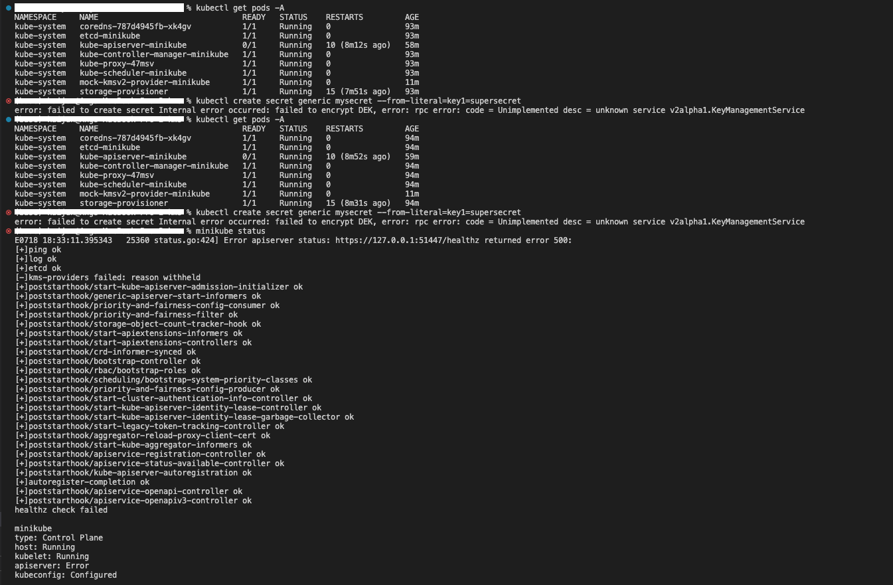

# KMS

### Introduction

This project is an extension of the Kubernetes KMSv2 feature, which aims to enable encryption-at-rest using a KMS plugin. The main motivation is to integrate a physical random generator into the on-premise server create a HSM-like system for more secure encryption.

In my design, the KMS plugin will communicate with an on-premise server via REST APIs. The encryption keys are generated by running a script on the on-premise server, and the encryption keys are then saved in the on-premise server. Only the ciphertext/ plaintext is returned to the plugin via REST APIs.

Code for the on-premise-server can be found at https://github.com/kaijun123/kms-on-premise-server

### Environment
- M1 Mac (arm64)
- Docker Desktop 4.9.0 
- Minikube v1.30.1 (Kubernetes v1.26.3)

### Directory
- ```pkg/scripts```: 
  - Contains yaml files for configuration and 2 shell scripts to simplify the configuration process. While enabling the KMS encryption, the 02_KMS_Encryption_At_Rest.sh is used.
  - The scripts will be run after running `minikube mount`
- ```pkg/plugins/plugin.go```: Entrance of the repo

### Issues
- Apiserver and storage-provisioner seems to keep on crashing and then restarting, for reasons that are unknown.
- Am I configuring sth wrongly? Or is this feature not available on minikube?

<p align="center">
    
</p>